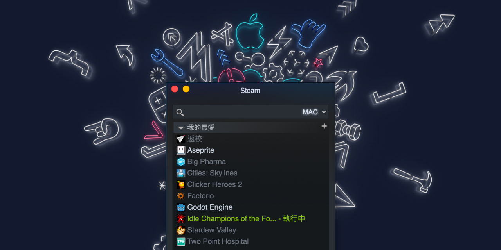

# Steamini

This project provides an app icon to open the Steam app in mini-games-list mode.



## Install

Requirement: You need to properly install the original Steam.

```sh
cd ~/Downloads
git clone https://github.com/Edditoria/Steamini.git
cp -R Steamini/Steamini.app ~/Applications
```

Or, manually [download the zip file][dld_link], extract it, then copy `Steamini.app` to `~/Applications/` in Finder.

## How Does It Works

When you open Steamini, it simply runs `open steam://open/minigameslist`.

## Uninstall

In Applications under your user directory, move Steamini(.app) to Trash/Bin. This application does not save any settings in other directories.

## Copyright and License

Created by Steam fans with love. This project is not an official Steam product, and is not affiliated with, or sponsored or endorsed by, Steam and Valve Corporation.

Code released under the [MIT License](LICENSE.txt).

The app icon is created and published by Sebastien Dancer-Michel in [Behance: Icon Pack for OSX El Capitan][icon_link]. Sebastien, thanks for your work!

[icon_link]: https://www.behance.net/gallery/27829949/Icon-Pack-for-OSX-El-Capitan
[dld_link]: https://github.com/Edditoria/Steamini/archive/refs/heads/main.zip
